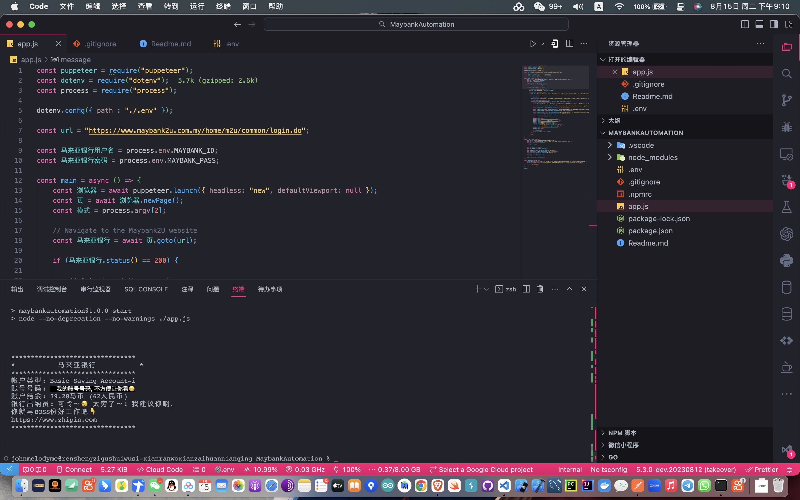

# 自动化马来亚银行
这是一个让您的金融管理体验变得智能、高效的令人兴奋的自动化工具。对于他，不必再费心手动查询余额、检查账户类型，甚至还能自如地执行银行转账。如果她正在忙着下载漂亮的PDF账户交易记录，那一定是在体验从未如此便捷的财务数据管理。而我，也深切感受到了自动化带来的变革，使金融操作变得更直观、更轻松。让我们一同探索这个项目，让金融科技在您的生活中绽放出新的魅力！


### 免责声明：
```
在您下载并运行本工具的源代码时，即表示您同意以下条款和条件。本工具旨在为您提供方便的网页自动化体验，仅供有兴趣的用户使用。我们强烈声明，您不得将本工具用于任何非法、欺诈、骗取信息或黑客活动。

您同意：

1. 使用规范：您同意使用本工具仅限于合法、诚信和道德的目的。您不得利用本工具进行任何非法、欺诈、恶意或侵权活动。

2. 严禁滥用：您保证不会滥用本工具，包括但不限于未经授权的访问、恶意攻击、数据窃取或任何危害他人安全和隐私的行为。

3. 免责声明：我们作为开发者，明确声明本工具不被设计用于任何欺诈、骗取信息或黑客活动。您理解并同意，我们不承担由于您滥用本工具而引起的任何法律、道德或道义责任。

4. 使用责任：您在使用本工具时需自行承担风险。我们不对因使用本工具而造成的任何损失、风险或后果负责。

5. 合法合规：您保证您的使用行为遵守所有适用的法律和法规。您不得在任何国家、地区或法域内违反当地的法律和法规。

通过下载、运行或使用本工具，您表示已充分理解并同意以上条款。如果您不同意这些条款，请不要使用本工具。我们强烈希望您遵循合法和道德的使用方式，以确保您和他人的权益和安全。

如果您对这些条款有任何疑问，请随时联系我们。您的安全和隐私始终是我们的首要关注。
```

### 示例演示
以下是示例演示的截图，展示了工具的界面和功能：
[](https://www.kuaishou.com/short-video/3x3u976d8treg4y?fid=3357252645&cc=more&followRefer=151&shareMethod=CARD&docId=10&kpn=NEBULA&subBiz=BROWSE_SLIDE_PHOTO&photoId=3x3u976d8treg4y&shareId=17579112419427&shareToken=X-47LjsQLrmWh1aw&shareResourceType=PHOTO_SELF&userId=3xwu9nh5xtk4a7a&shareType=2&et=1_i%252F0_unknown0&shareMode=APP&originShareId=17579112419427&appType=2&inviteCode=zx26729&shareObjectId=5250352848875484377&shareUrlOpened=0&timestamp=1692111825664&sharePullHoldout=1&utm_source=app_share&utm_medium=app_share&utm_campaign=app_share&location=app_share)


### 配置 .env 文件

为了使自动化脚本顺利运行，您需要在项目的根目录中设置一个 `.env` 文件。此文件包含了自动化脚本所需的敏感信息。请按照以下步骤设置 `.env` 文件：

1. 如果尚未创建，您需要在项目的根目录中创建一个名为 `.env` 的文件。

2. 使用文本编辑器打开 `.env` 文件。

3. 将以下内容添加到 `.env` 文件中，并用您实际的马来亚银行凭证替换占位符：

```
MAYBANK_ID=xxxxxxxxxxxxxxxxxxx
MAYBANK_PASS=xxxxxxxxxxxxxxxxxx
```

> 请注意："MAYBANK_ID" 是您的马来亚银行登录用户名，"MAYBANK_PASS" 是密码。请务必谨慎保管这些敏感信息。为了您的账户安全，请勿将 .env 文件上传至云端、源码库或互联网。作为该工具的开发者，我绝不会以欺诈或黑客行为为目的。您的安全和隐私始终是我们的首要关注。

4. 保存 `.env` 文件。

现在，您的自动化脚本将能够从 `.env` 文件中安全地获取所需的凭证。

### 故障排除

如果您遇到错误消息，内容为表示 **《.env 文件不存在》**，这意味着 `.env` 文件缺失。请确保您已按照上述步骤创建 `.env` 文件，并填写了所需的凭证信息。

### 安装
在开始之前，请确保您已经完成安装。只需在终端中运行以下命令，就能为您的金融之旅做好准备：

```
npm install --save
```

### 启动应用程序
只需输入以下命令，让奇妙的自动化之旅开始：

```bash
npm start
```

### 预期返回消息

此时，您将会收到一则充满魔力的欢迎消息，宛如从金融仙境而来：

```
帐户类型：xxxxxxxxxxxx
账号号码：xxxxxxxxxxxxxxxxxxxxx
账户结余：xxxxxxx 马币（xxxxxxx人民币）
银行出纳员：xxxxxxxx
```


### 个人捐赠支持
如果您认为该项目对您有所帮助，并且愿意个人捐赠以支持其持续发展和维护，🥰我非常感激您的慷慨。
您的捐赠将帮助我继续改进和添加新功能到该项目中。 通过财务捐赠，您将有助于确保该项目保持免
费和对所有人开放。即使是一小笔捐款也能产生巨大的影响，也是对我个人的鼓励。

以下是我的支付宝二维码，您可以扫描二维码进行个人捐赠：

<br />
<br />
<div style="display: flex; justify-content: space-between; margin-bottom: 20px;">
  
  <br >
  
</div>

**🥰😘🥰😘再次衷心感谢您的支持和慷慨！**
